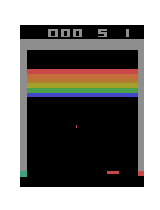

## Playing Atari Breakout with Deep Reinforcement Learning
The details about the project, previous work, our contributions, and our results can be found in the [report](./report.pdf) and the [presentation](https://docs.google.com/presentation/d/1WWJER8nA879T-J6VcevzcG1zFHQxhF4Z-7cj5Inmci4/edit?usp=sharing). [Here](https://arxiv.org/pdf/1312.5602.pdf) is paper implemented: Playing Atari with Deep Reinforcement Learning
Volodymyr Mnih Koray Kavukcuoglu David Silver Alex Graves Ioannis Antonoglou
Daan Wierstra Martin Riedmiller
DeepMind Technologies
### Results
No Training       |  Early stage of Training       |  Later Stage of Training
:-------------------------:|:------------------------:|:-------------------------:|
  |    |  
